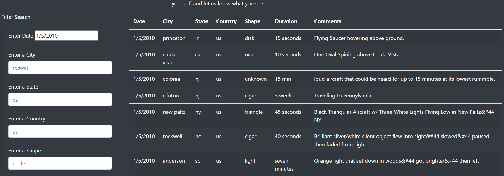
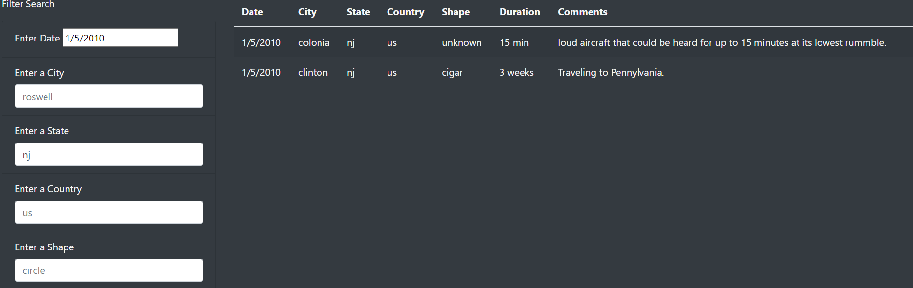

### UFOs

## Overview of Project
Dana is building a website, including the news about UFOs and data of UFOs sighting. The purpose of the project is to help Dana enable further filter and search function on the UFOs sighting, allowing users to filter city, state, country, ufo shape, in addition to the date. 

## Results
- After adding more criteria into the Filter Search function, we will be able to further filter the UFO sighting data.
# Start filtering by date
- It will be easier to eliminiate the huge amount of data by starting with a specific date.We can input the data according to the one shown in the original data. For example: input "1/5/2010".

  By filtering date, we successfully narrow 111 rows of data into 7.

# Select more criteria to filter more
- After date, we can further select either one of the criteria to further narrow down the search result. For example: "State". We can see the detailed info under each selected state. For example: let's input "nj" to view the info in New Jersey.

  By selecting the second criteria, we further narrow down to 2 lines of data.

## Summary
# Drawback of the webpage
Even though the filter search function with multiple criteria can effectively help us filter through the data, without knowing the range, data format of each criteria, we may input invalid search data resulting in no searching results.

# Recommendations
- Define the search data range
  For example, we can define the datetime range from 1/1/2010 to 1/13/2010. Or for the shape, we can enable a dropdown list to allow users to select from the available shape, which can make the webpage more user-friendly;

- Define the input data format
 The other way to increase the user experience is to specify the input data format. for example, we can specify the datetime format as "MM/DD/YY" so to standardize the input format. Or for the state, we can make input not lettercase sensitive, so that it will still be valid even though the user input "CA" for California. 

